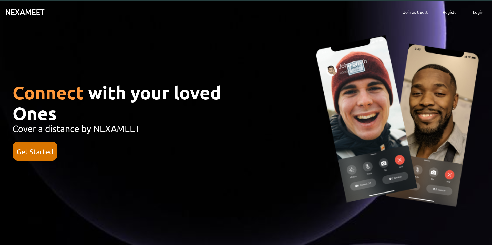
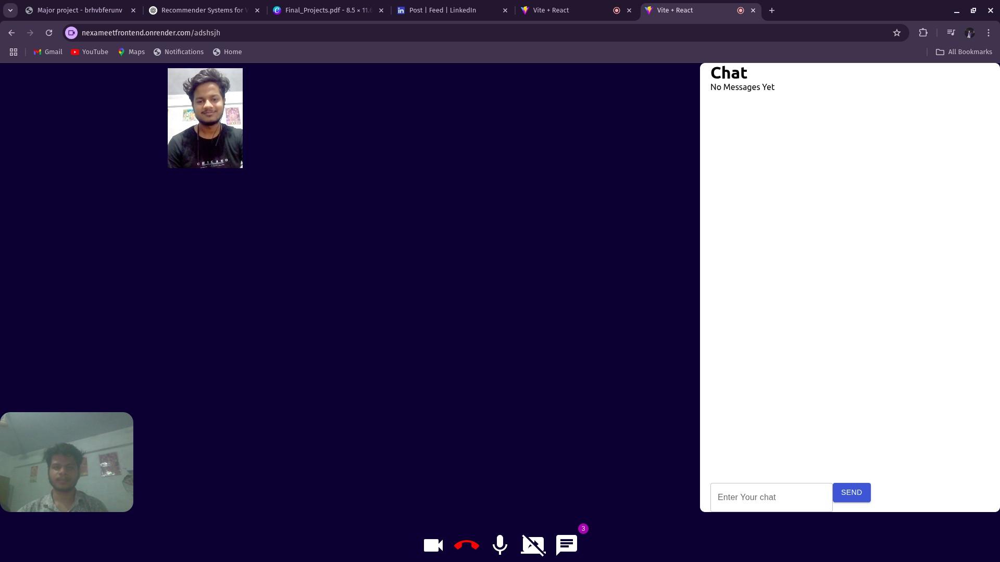

<h1 align="center">🚀 NEXAMEET - Your Zoom Alternative</h1>

<p align="center">
  <b>A real-time video conferencing app built with WebRTC and Socket.IO</b><br/>
  Join, meet, share screen, and chat — all from your browser 🌐
</p>

<p align="center">
  
  
  
  
</p>

---

## 🎯 Features

- 📹 Real-time video & audio calling (WebRTC)
- 💬 Live chat messaging using Socket.IO
- 👥 Multi-user room support
- 🖥️ Screen sharing for presentations & demos
- 🔗 Shareable room links for easy meeting access
- 🔐 Unique Room ID for every session
- 🎨 Clean & responsive UI across all devices

---

## 🛠️ Tech Stack

| Category     | Tools Used                                |
|--------------|--------------------------------------------|
| **Frontend** | HTML5, CSS, ReactJS            |
| **Backend**  | Node.js, Express.js                        |
| **Real-time**| WebRTC, Socket.IO                          |
| **Deployment** | Render (Backend)                         |

---

## 📷 Screenshots

> _Show off your app visually! Add screenshots like this:_




---

## 🚀 Getting Started

### 📦 Clone the repository

```bash
git clone https://github.com/kumarshubhh/nexameet.git
cd nexameet
